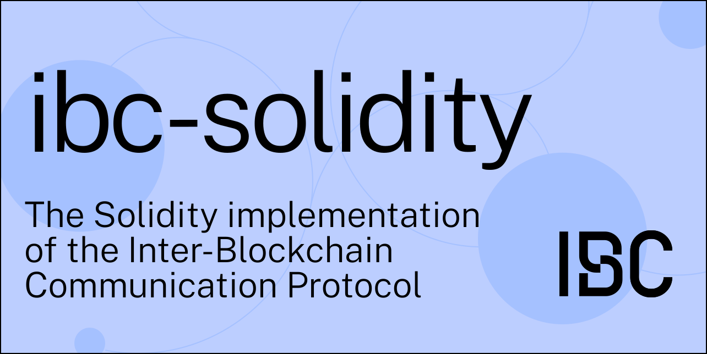

<div align="center">
  <h1>ibc-solidity</h1>
</div>



<div align="center">
  
  <a href="https://github.com/hyperledger-labs/yui-ibc-solidity/blob/main/LICENSE">
    
  </a>
  <a href="https://github.com/hyperledger-labs/yui-ibc-solidity/actions/workflows/test.yml">
    
  </a>
  <a href="https://pkg.go.dev/github.com/hyperledger-labs/yui-ibc-solidity?tab=doc">
    
  </a>
</div>

[IBC](https://github.com/cosmos/ibc) implementations in Solidity.

**IBC compatibility:** [v8](https://github.com/cosmos/ibc-go/releases/tag/v8.2.0)

This is available not only for Ethereum and Hyperledger Besu, but also for Polygon PoS and other EVM-compatible chains.

DISCLAIMER: This project is still under development and has not been audited.

## Features

- Implementation of [ICS](https://github.com/cosmos/ibc/tree/master/spec/core)
- Implementation of [ICS-20](https://github.com/cosmos/ibc/tree/master/spec/app/ics-020-fungible-token-transfer)
- [ERC-20 Token Transfer](./contracts/apps/20-transfer/ICS20TransferBank.sol)

## Documents

- [Architecture Overview](./docs/architecture.md)
- [Learn how to develop an IBC Module](https://labs.hyperledger.org/yui-docs/yui-ibc-solidity/)
- [IBFT 2.0 Light Client spec](./docs/ibft2-light-client.md)

## Supported Light Client

You can deploy a Light Client that implements [the ILightClient interface](./contracts/core/02-client/ILightClient.sol) to [integrate with ibc-solidity](./docs/architecture.md#light-client).

Here are some such examples:
- [Tendermint ZK Light Client](https://github.com/datachainlab/tendermint-zk-ibc)
- [IBFT 2.0 Light Client](./contracts/clients/IBFT2Client.sol)
- [LCP(TEE) Client](https://github.com/datachainlab/lcp-solidity)
- [Localhost Client](./contracts/clients/LocalhostClient.sol)

## IBC relayer support

- [yui-relayer](https://github.com/datachainlab/yui-relayer): An IBC relayer for heterogeneous chains
- [ethereum-ibc-relay-chain](https://github.com/datachainlab/ethereum-ibc-relay-chain): A relay-chain module for EVM-compatible chains
- [ethereum-ibc-relay-prover](https://github.com/datachainlab/ethereum-ibc-relay-prover): A relay-prover module for Ethereum sync committee
- [ibft2-relay-prover](https://github.com/datachainlab/ibft2-relay-prover): A relay-prover module for IBFT 2.0 consensus

## Related projects

- A demo of trustless bridge
    - between Harmony and Cosmos(Tendermint): https://github.com/datachainlab/harmony-cosmos-bridge-demo
    - between Celo and Cosmos: https://github.com/ChorusOne/celo-cosmos-bridge
- A demo of bridge between Cosmos(ibc-go) and Ethereum using IBC and LCP: https://github.com/datachainlab/cosmos-ethereum-ibc-lcp

## For Developers

### Unit test

```sh
$ make test
```

### E2E test

Launch two Hyperledger Besu chains(ethereum-compatible) with the contracts deployed with the following command:

```sh
$ make network-e2e
```

After launch the chains, execute the following command:

```
$ make e2e-test
```

### E2E-test with IBC-Relayer

An example of E2E with IBC-Relayer([yui-relayer](https://github.com/hyperledger-labs/yui-relayer)) can be found here:
- https://github.com/datachainlab/ibft2-relay-prover/tree/main/e2e
- https://github.com/datachainlab/yui-relayer-build/tree/v0.4/tests/cases/eth2eth
- https://github.com/datachainlab/yui-relayer-build/blob/v0.4/.github/workflows/v0.4-eth2eth.yml

### solidity-protobuf

To generate the proto encoders and decoders in solidity from proto files, you need to use the code generator [solidity-protobuf](https://github.com/datachainlab/solidity-protobuf)

Currently, [v0.1.0](https://github.com/datachainlab/solidity-protobuf/tree/v0.1.0) is required.

If you edit the proto definitions, you should execute the following command:
```
$ make SOLPB_DIR=/path/to/solidity-protobuf proto-sol
```

## Maintainers

- [Jun Kimura](https://github.com/bluele)
