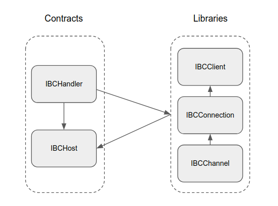
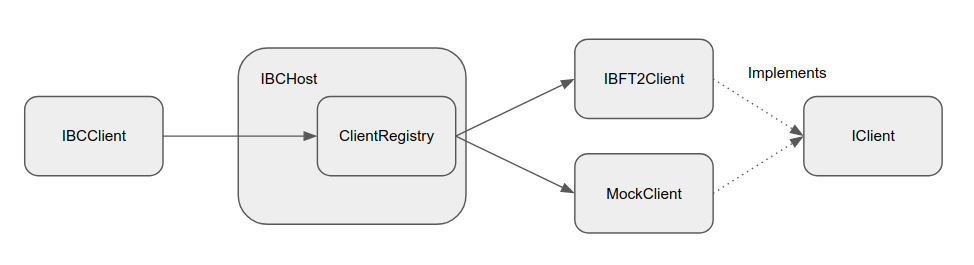
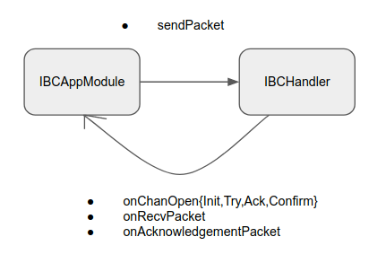

# Architecture

NOTE: This document is WIP

## Context

IBC-Solidity is a solidity implementation of ICS. This document provides an overview of the architecture and contracts.

## Architecture Diagrams

## IBCHost

[IBCHost](../contracts/core/IBCHost.sol) is a contract that implements [ics-024](https://github.com/cosmos/ibc/tree/master/spec/core/ics-024-host-requirements) and [ics-005](https://github.com/cosmos/ibc/tree/master/spec/core/ics-005-port-allocation).

IBCHost holds all the states of the IBC and provides accessor functions for them.

As shown in fig.1, these functions are usually called from each library, such as IBCClient, IBCConnection, IBCChannel, and so on.

It also implements authentication as defined in ics-005. For this purpose cosmos-sdk implements object-capability, but we implement the source authentication.

## IBCHandler

[IBCHandler](../contracts/core/IBCHandler.sol) is a contract that implements [ics-025](https://github.com/cosmos/ibc/tree/master/spec/core/ics-025-handler-interface).

IBCHandler provides an interface to the functions defined in ICS, which are called from the relayer and IBCAppModules.

As shown in fig.1, IBCHandler holds the address of the IBCHost contract and calls each library function with it as an argument.

## IBCClient

[IBCClient](../contracts/core/IBCClient.sol) is a library that implements [ics-002](https://github.com/cosmos/ibc/tree/master/spec/core/ics-002-client-semantics).

IBCClient provides the initialization and update function for the light-client, and accessor functions to the client implementation. (fig.2)

To use an IBC Client implementation, you need to register it with IBCHandler function `function registerClient(string calldata clientType, IClient client)`. Also, the client must implement [IClient interface](../contracts/core/IClient.sol).

The currently supported clients are [IBFT2Client](../contracts/core/IBFT2Client.sol) and [MockClient](../contracts/core/MockClient.sol).

## IBFT2Client

[IBFT2Client](../contracts/core/IBFT2Client.sol) is a contract that implements [IBFT 2.0 Light Client](./ibft2-light-client.md).

## MockClient

[MockClient](../contracts/core/MockClient.sol) is a contract that implements a client doesn't verify anything.

It is intended to be used only in testing environments such as ganache-cli.

## IBCConnection

[IBCConnection](../contracts/core/IBCConnection.sol) is a library that implements [ics-003](https://github.com/cosmos/ibc/tree/master/spec/core/ics-003-connection-semantics).

## IBCChannel

[IBCChannel](../contracts/core/IBCChannel.sol) is a library that implements [ics-004](https://github.com/cosmos/ibc/tree/master/spec/core/ics-004-channel-and-packet-semantics).

## IBCAppModule

IBCAppModule is a contract that integrates with IBC. The contract must implement [IModuleCallbacks interface](../contracts/core/IBCModule.sol).

IBCAppModule and IBCHandler are cross-referenced as shown in fig.3. When a channel handshake process or a packet is received, IBCHandler calls the corresponding IBCAppModule's callback function. On the other hand, IBCAppModule calls IBCHandler's function to send packets.

An example of IBCAppModule implementation is [ICS20Transfer](../contracts/app/ICS20Transfer.sol).
