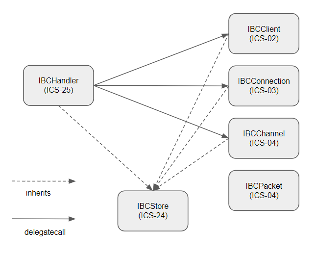

## Context

IBC-Solidity is an IBC implementation in solidity. Many implementations comply with [ICS](https://github.com/cosmos/ibc) and [ibc-go](https://github.com/cosmos/ibc-go).

This document describes the overview of architecture and key points that we consider the limitations of ethereum and solidity.

## Repository Structure

The repository has the following structure. `core` and `apps` directory names basically correspond to ICS.

```
contracts/
    apps/
        20-transfer/     … ics-20
        commons/         … common contracts/libraries for apps
    clients/
        IBFT2Client.sol  … Light Client for IBFT 2.0 consensus
        MockClient.sol   … Mock Client
    core/
        02-client/       … ics-02
        03-connection/   … ics-03
        04-channel/      … ics-04
        24-host/         … ics-24
        25-handler/      … ics-25
    proto/               … code generated by solidity-protobuf
```

## Architecture Overview



To relax the contract size limit of ethereum, each ICS implementation is split into [IBCClient](../contracts/core/02-client/IBCClient.sol), [IBCConnection](../contracts/core/03-connection/IBCConnection.sol), [IBCChannel](../contracts/core/04-channel/IBCChannelHandshake.sol), [IBCPacket](../contracts/core/04-channel/IBCPacket.sol), and [IBCHandler](../contracts/core/25-handler/IBCHandler.sol) contracts, as shown in the above figure.

In general, such a design causes storage splitting, so it is required to implement unnecessary authentication and accessors for inter-contract calls.

In ibc-solidity, each contract inherits [IBCStore](../contracts/core/24-host/IBCStore.sol) contract that defines the common storage layout and uses `delegatecall` for contract calls to avoid this.

## Store and Commitment

In IBC, two types of stores are defined: `provableStore` and `privateStore`. The following are the requirements for each store:

https://github.com/cosmos/ibc/blob/01dbba90d238169c4905c7b11969ec7987e22729/spec/core/ics-024-host-requirements/README.md?plain=1#L63.
> The `provableStore`:
>
> - MUST write to a key/value store whose data can be externally proved with a vector commitment as defined in [ICS 23](../ics-023-vector-commitments). 
> - MUST use canonical data structure encodings provided in these specifications as proto3 files
>
> The `privateStore`:
>
> - MAY support external proofs, but is not required to - the IBC handler will never write data to it which needs to be proved.
> - MAY use canonical proto3 data structures, but is not required to - it can use whatever format is preferred by the application environment.

In ibc-solidity, we define state variables (e.g. connections, channels) of the type defined with proto3 corresponding to each state. In addition, define a mapping state variable that represents the commitments to satisfy the externally provable property of the `provableStore`. For the key of the mapping, keccak256 of the ICS-23 `Path` is used, and for the value, keccak256 of the ICS-23 `Value` is used.

So how do we get a proof of the commitments state variable? In Solidity, state variables of contracts defined are stored in storage according to [this layout spec](https://docs.soliditylang.org/en/latest/internals/layout_in_storage.html).

The storage location for each commitment is calculated as follows: assume that the slot of the commitments state variable is `s` and a ICS-23 commitment path is `p`, the storage location is `keccak256(keccak256(p) . s)`.

Also, you can query an existence/non-existence proof of a commitment corresponding to the location using [`eth_getProof`](https://eips.ethereum.org/EIPS/eip-1186) provided by ethereum execution client. An example go code is [here](https://github.com/datachainlab/ethereum-ibc-relay-prover/blob/074f9a895e50aa49c4c4a1df2c679f2c10c096db/relay/prover.go#L416).

## Light Client

You can support any light client via developing a contract that implements [ILightClient interface](../contracts/core/02-client/ILightClient.sol). It also can be registered through `registerClient` function in `IBCHandler`.

`ILightClient` interface includes the following functions:

- `createClient`: Creates a new client with the given state. If successful, it returns a commitment for the initial state.

- `updateClient`: Updates the client corresponding to the given clientId. If successful, it returns a commitment for the updated state. If there are no updates for the consensus state, this function returns an empty array of ConsensusStateUpdate objects.

- `verifyMembership`: A generic proof verification method that verifies the existence of a value at a given CommitmentPath and height. The caller is expected to construct the full CommitmentPath from a CommitmentPrefix and a standardized path as defined in ICS-24.

- `verifyNonMembership`: A generic proof verification method that verifies the absence of a given CommitmentPath at a specified height. The caller is expected to construct the full CommitmentPath from a CommitmentPrefix and a standardized path as defined in ICS-24.

The registered light client can be instantiated by `createClient`, which can be used to verify the handshake process to establish connections and channels.

Different from ibc-go, the light client contract keeps the state in own contract storage in ibc-solidity. This is an optimization based on the high cost of serialization state and read/write storage in solidity. For this reason, `createClient` and `updateClient` only return a commitment.

## Applications

Developers can register an App module that implements [IIBCModule interface](../contracts/core/05-port/IIBCModule.sol) via `bindPort` of `IBCHandler`. The registered contract becomes available through a channel established by the handshake process with the corresponding port.

The following is a simple App example that only checks that the message sent and the one returned from the destination chain match.

```solidity
contract EchoApp is IBCAppBase {
    IBCHandler private immutable ibcHandler;

    constructor(IBCHandler ibcHandler_) {
        ibcHandler = ibcHandler_;
    }

    // An entry point of this app
    function sendMessage(
        string calldata sourcePort,
        string calldata sourceChannel,
        uint64 timeoutHeight,
        uint64 timeoutTimestamp
    ) external {
        // NOTE: `ibcHandler` checks if the app contract is a valid channel owner
        // Otherwise, the function call is reverted
        ibcHandler.sendPacket(
            sourcePort,
            sourceChannel,
            Height.Data({revision_number: 0, revision_height: timeoutHeight}),
            timeoutTimestamp,
            bytes("hello")
        );
    }

    // just return a received message as packet acknowledgement 
    function onRecvPacket(Packet.Data calldata packet, address relayer) external virtual override onlyIBC
        returns (bytes memory acknowledgement)
    {
        return packet.data;
    }

    // ensure that the message returned by the packet receiver matches the one sent
    function onAcknowledgementPacket(Packet.Data calldata packet, bytes calldata acknowledgement, address relayer) external virtual override onlyIBC
    {
        require(keccak256(acknowledgement) == keccak256(bytes("hello")));
    }

    // onlyIBC modifier checks if a caller matches `ibcAddress()`
    function ibcAddress() public view virtual override returns (address) {
        return address(ibcHandler);
    }
}
```

The packet sending flow using the `EchoApp` is the following:

1. src chain: send a packet containing "hello" as data qith `sendMessage` of the `EchoApp`.
2. dst chain:
	- The relayer submits the packet from 1 with `recvPacket` of the `IBCHandler`.
	- The `IBCHandler` ensure that the packet commitment is valid and calls `onRecvPacket` of the `EchoApp`.
	- `onRecvPacket` returns the received packet data as acknowledgement data
3. src chain:
	- The relayer submits the 1. packet and 2. acknowledgement
	- The `IBCHandler` ensure that the acknowledgement commitment is valid and calls `onAcknowledgementPacket` of the `EchoApp`.
	- In `onAcknowledgementPacket`, ensure that acknowledgement data matches the send message("hello")

Also, an App can define callback functions for state transitions in the channel handshake. See [IIBCModule interface](../contracts/core/05-port/IIBCModule.sol) for more details.

Further example implementations are [ICS-20 implementation](../contracts/apps/20-transfer) and a [tutorial](https://labs.hyperledger.org/yui-docs/yui-ibc-solidity/minitoken/overview) that describes e2e packet relay using a small IBC-App called minitoken.
