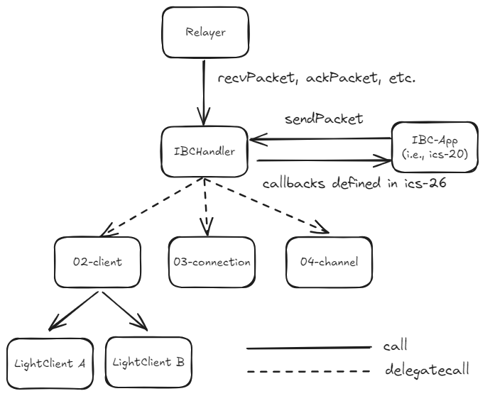

## Context

ibc-solidity is a Solidity-based implementation of the [Inter-Blockchain Communication (IBC)](https://github.com/cosmos/ibc) protocol that is fully compliant with the Interchain Standards (ICS) defined by Cosmos. ibc-solidity provides a reliable and standardised framework for cross-chain communication on Ethereum and other EVM-compatible blockchains.

This document outlines the architectural design and key considerations for overcoming the limitations specific to Ethereum and Solidity. 

## Repository Structure

The repository has the following structure. `core` and `apps` directory names basically correspond to ICS.

```
contracts/
    apps/
        20-transfer/     … ics-20
        commons/         … common contracts/libraries for apps
        mock/            … mock contracts for testing
    clients/
        09-localhost/    … ics-09
        mock/            … mock client for testing
        qbft/            … Light Client for QBFT/IBFT 2.0 consensus
    core/
        02-client/       … ics-02
        03-connection/   … ics-03
        04-channel/      … ics-04
        24-host/         … ics-24
        25-handler/      … ics-25
        26-router/       … ics-26
    proto/               … code generated by solidity-protobuf
```

## Architecture Overview



The architecture of ibc-solidity is designed with Ethereum’s contract size limit (24KB) in mind. For this reason, the functionality of each ICS (Interchain Standards) module is separated across multiple contracts as follows:

- ics-02: [`IBCClient`](../contracts/core/02-client/IBCClient.sol)
- ics-03: [`IBCConnection`](../contracts/core/03-connection/IBCConnection.sol)
- ics-04: [`IBCChannelHandshake`](../contracts/core/04-channel/IBCChannelHandshake.sol), [`IBCChannelPacketSendRecv`](../contracts/core/04-channel/IBCChannelPacketSendRecv.sol), [`IBCChannelPacketTimeout`](../contracts/core/04-channel/IBCChannelPacketTimeout.sol), [`IBCChannelUpgradeInitTryAck`](../contracts/core/04-channel/IBCChannelUpgrade.sol), [`IBCChannelUpgradeConfirmOpenTimeoutCancel`](../contracts/core/04-channel/IBCChannelUpgrade.sol)
- ics-{24,25,26}: [`IBCHandler`](../contracts//core/25-handler/IBCHandler.sol)

The `IBCHandler` is the main contract that has a storage and receives function calls and delegates them to other contracts.

Each contract inherits the [`IBCStore`](../contracts/core/24-host/IBCStore.sol) contract, which defines the common storage layout, and calls from the `IBCHandler` to each contract are performed using `delegatecall`. This approach allows the contracts to share common state between each other.

## Store and Commitment

In IBC, two types of stores are defined: `provableStore` and `privateStore`. The following are the requirements for each store:

https://github.com/cosmos/ibc/blob/01dbba90d238169c4905c7b11969ec7987e22729/spec/core/ics-024-host-requirements/README.md?plain=1#L63.
> The `provableStore`:
>
> - MUST write to a key/value store whose data can be externally proved with a vector commitment as defined in [ICS 23](../ics-023-vector-commitments). 
> - MUST use canonical data structure encodings provided in these specifications as proto3 files
>
> The `privateStore`:
>
> - MAY support external proofs, but is not required to - the IBC handler will never write data to it which needs to be proved.
> - MAY use canonical proto3 data structures, but is not required to - it can use whatever format is preferred by the application environment.

The `privateStore` only holds state, whereas the `provableStore` holds state that can be externally verified. Currently, in `ibc-go`, both stores are implemented using the same externally provable store. This results in a tightly coupled implementation of state and commitments.

In `ibc-solidity`, unlike `ibc-go`, state and commitments are stored separately. Regardless of the store type, each state is represented by a corresponding state variable, and for provableStore, the commitment and its associated path are also stored in the commitments mapping. The advantage of this approach is the simplification of the commitment proof specification. Additionally, for both connections and channels, state updates rarely occur after establishment once, so increased gas costs are not a significant issue in most use cases.

The `commitments` mapping, representing the commitments, is defined as follows:

```solidity
/// @custom:storage-location erc7201:ibc.commitment
struct CommitmentStorage {
    mapping(bytes32 => bytes32) commitments;
}
```

The key for this mapping is the `keccak256` hash of the ICS-23 Path, and the value is the `keccak256` hash of the ICS-23 Value. The `CommitmentStorage` follows the ERC-7201 standard, and its storage is located at:

```
keccak256(abi.encode(uint256(keccak256("ibc.commitment")) - 1)) & ~bytes32(uint256(0xff))
```

This resolves to:

```
0x1ee222554989dda120e26ecacf756fe1235cd8d726706b57517715dde4f0c900
```

The storage location corresponding to the values in the mapping is stored according to [Solidity's mapping layout specification](https://docs.soliditylang.org/en/latest/internals/layout_in_storage.html).

Therefore, the storage location for a commitment is:

```
keccak256(keccak256(p) . s)
```

where `p` is the ICS-23 path, and `s` is the `CommitmentStorage` storage location(i.e., 0x1ee222554989dda120e26ecacf756fe1235cd8d726706b57517715dde4f0c900). A relayer can obtain a proof of the existence or non-existence of the commitment at this location using `eth_getProof`, as defined in [EIP-1186](https://eips.ethereum.org/EIPS/eip-1186).


## Light Client

You can support light client by developing a contract that implements [ILightClient interface](../contracts/core/02-client/ILightClient.sol). It also can be registered through `registerClient` function in `IBCHandler`.

`ILightClient` interface includes the following functions:

- `initializeClient`: Initializes the client corresponding to the given clientId. If successful, it returns a consensus height of the client. This function is called only once per client via the `createClient` function of the IBCHandler.

- `routeUpdateClient`: Receives a client message and routes it to the corresponding contract function and its arguments. This function is called by the IBCHandler or a relayer. This spec is based on `ADR-001`.

- `verifyMembership`: A generic proof verification method that verifies the existence of a value at a given CommitmentPath and height. The caller is expected to construct the full CommitmentPath from a CommitmentPrefix and a standardized path as defined in ICS-24. This function is called by the IBCHandler.

- `verifyNonMembership`: A generic proof verification method that verifies the absence of a given CommitmentPath at a specified height. The caller is expected to construct the full CommitmentPath from a CommitmentPrefix and a standardized path as defined in ICS-24. This function is called by the IBCHandler.

Main differences in design from ibc-go are as follows:

- The light client contract maintains the state in its own contract storage
- Direct calls to the light client contract are supported using `routeUpdateClient` function

## Applications

Developers can register an App module that implements [IIBCModule interface](../contracts/core/26-router/IIBCModule.sol) via `bindPort` of `IBCHandler`. The registered contract becomes available through a channel established by the handshake process.

The following is a simple example that `hello` message is sent and received:

```solidity
contract EchoApp is IBCAppBase {
    IBCHandler private immutable ibcHandler;

    constructor(IBCHandler ibcHandler_) {
        ibcHandler = ibcHandler_;
    }

    // An entry point of this app
    function sendMessage(
        string calldata sourcePort,
        string calldata sourceChannel,
        uint64 timeoutHeight,
        uint64 timeoutTimestamp
    ) external {
        // NOTE: `ibcHandler` checks if the app contract is a valid channel owner
        // Otherwise, the function call is reverted
        ibcHandler.sendPacket(
            sourcePort,
            sourceChannel,
            Height.Data({revision_number: 0, revision_height: timeoutHeight}),
            timeoutTimestamp,
            bytes("hello")
        );
    }

    // just return a received message as packet acknowledgement 
    function onRecvPacket(Packet.Data calldata packet, address relayer) external virtual override onlyIBC
        returns (bytes memory acknowledgement)
    {
        return packet.data;
    }

    // ensure that the message returned by the packet receiver matches the one sent
    function onAcknowledgementPacket(Packet.Data calldata packet, bytes calldata acknowledgement, address relayer) external virtual override onlyIBC
    {
        require(keccak256(acknowledgement) == keccak256(bytes("hello")));
    }

    // onlyIBC modifier checks if a caller matches `ibcAddress()`
    function ibcAddress() public view virtual override returns (address) {
        return address(ibcHandler);
    }
}
```

The packet sending flow using the app(i.e., `EchoApp`) is the following:

1. src chain: send a packet containing "hello" as data qith `sendMessage` of the `EchoApp`.
2. dst chain:
	- The relayer submits the packet from 1 with `recvPacket` of the `IBCHandler`.
	- The `IBCHandler` ensure that the packet commitment is valid and calls `onRecvPacket` of the `EchoApp`.
	- `onRecvPacket` returns the received packet data as acknowledgement data
3. src chain:
	- The relayer submits the 1. packet and 2. acknowledgement
	- The `IBCHandler` ensure that the acknowledgement commitment is valid and calls `onAcknowledgementPacket` of the `EchoApp`.
	- In `onAcknowledgementPacket`, ensure that acknowledgement data matches the send message("hello")

Also, an App can define callback functions for state transitions in the channel handshake. See [IIBCModule interface](../contracts/core/26-router/IIBCModule.sol) for more details.

Further example implementations are [ICS-20 implementation](../contracts/apps/20-transfer) and a [tutorial](https://labs.hyperledger.org/yui-docs/yui-ibc-solidity/minitoken/overview) that describes e2e packet relay using a simple IBC-App called minitoken.

## Security Model

The security model of `IBCHandler` is based on the following assumptions and considerations:

- **Safety**
    - Light Client must satisfies the [desired properties of ICS-02](https://github.com/cosmos/ibc/tree/main/spec/core/ics-002-client-semantics): All light client contracts registered with `IBCHandler` must satisfy the desired properties defined by ICS-02.

    - Correct Light Client implementation: Light client implementation must be verified as non-malicious before being registered with `IBCHandler` by authenticated actors (e.g., the contract owner). Examples of malicious code include reentrancy attacks through `IBCHandler` or `IBCModule`.

- **Liveness**
    - Existence of Honest Relayer: The liveness of the IBC protocol assumes the existence of at least one honest relayer. If there are no honest relayers, the packet relay will not proceed.

- **Additional Considerations**
    - Even if a malicious IBC Module is registered via `bindPort`, its threat is isolated to the channels associated with that port and does not affect other channels or modules.
    - When using `IBCConnectionSelfStateNoValidation` as an implementation of `IBCConnection`, there is a risk that misconfigured connections or channels being configured by malicious relayers, creating connections reffering to different chains. To prevent this, Social Consensus is required, as outlined [here](https://github.com/cosmos/ibc/blob/main/spec/core/ics-003-connection-semantics/client-validation-removal.md#social-consensus). Note that this is default trust model for the connection handshake in ibc-go v9 and later. If you want to remove this trust assumption, you must implement a contract inherits `IBCConnection` and state validation of the host chain.
